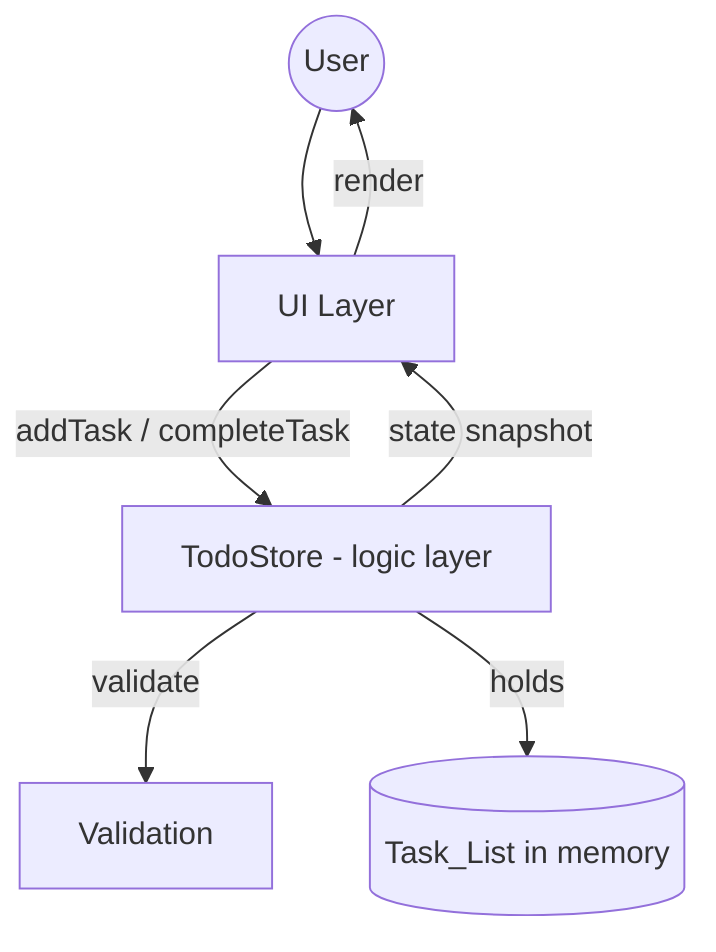
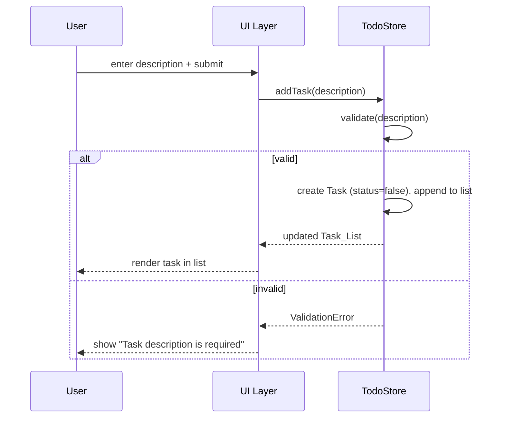

# Design Document

## Overview

The Todo feature provides a small, self-contained task management capability. It supports three user actions: adding a task, marking a task as completed, and rejecting empty task submissions with a validation error. The design favors a simple, testable core that separates task management logic from presentation so the same logic can be verified independently of any UI.

The core of the feature is a `TodoStore` that owns the `Task_List` and exposes a small set of operations. A thin UI layer renders the list and forwards user intents (add, complete) to the store. Validation is performed at the store boundary so no invalid task can ever enter the list.

This design targets a typical single-page web application (framework-agnostic), but the logic layer is plain and portable, making it usable in any runtime.

## Architecture

The feature uses a layered architecture that keeps business logic independent of the UI.



Layers:

- **UI Layer**: Captures user input, calls store operations, renders the current `Task_List`, shows completed indicators, and surfaces validation errors. Contains no business rules.
- **Logic Layer (`TodoStore`)**: Single source of truth for the `Task_List`. Owns `addTask`, `completeTask`, and internal validation. Guarantees invariants (e.g., no empty tasks, valid completion status).
- **Validation**: A pure function used by the store to decide whether a `Task_Description` is acceptable.

Data flow for adding a task:



## Components and Interfaces

### TodoStore (logic layer)

Responsible for all task state and rules.

```typescript
interface TodoStore {
  // Returns a snapshot of the current task list.
  getTasks(): Task[];

  // Adds a task if the description is valid.
  // Returns the created Task on success, or a ValidationError on failure.
  addTask(description: string): AddResult;

  // Marks an existing task as completed by id.
  // No-op-safe: returns the task if found; completion is idempotent.
  completeTask(id: TaskId): Task | undefined;
}

type AddResult =
  | { ok: true; task: Task }
  | { ok: false; error: ValidationError };
```

### Validation

```typescript
// Pure function. Returns null when valid, otherwise a ValidationError.
function validateDescription(description: string): ValidationError | null;
```

Rule: a description is valid when, after trimming leading and trailing whitespace, it contains at least one character. Empty strings and whitespace-only strings are invalid.

### UI Layer

- Renders each task with its description and a completed indicator driven by `Completion_Status`.
- Invokes `addTask` on submit; on a returned `ValidationError`, displays the error message.
- Invokes `completeTask` when the user selects a task to complete.

The UI holds no authoritative state; it reflects the store snapshot.

## Data Models

### Task

| Field | Type | Description |
|-------|------|-------------|
| `id` | `TaskId` (string) | Unique identifier assigned on creation. |
| `description` | `string` | The `Task_Description`. Always non-empty after trimming. |
| `completed` | `boolean` | `Completion_Status`. `false` at creation. |

```typescript
type TaskId = string;

interface Task {
  id: TaskId;
  description: string;
  completed: boolean;
}
```

### ValidationError

```typescript
interface ValidationError {
  code: "EMPTY_DESCRIPTION";
  message: string; // e.g., "A task description is required."
}
```

### Task_List

An ordered, in-memory collection of `Task` objects. New tasks are appended, preserving insertion order. Completed tasks are retained in the list.

## Correctness Properties


*A property is a characteristic or behavior that should hold true across all valid executions of a system-essentially, a formal statement about what the system should do. Properties serve as the bridge between human-readable specifications and machine-verifiable correctness guarantees.*

The following properties were derived from the acceptance criteria. Redundant criteria were consolidated: the "add" criteria (1.1, 1.3, 1.4) collapse into a single membership property; the completion state change (2.1) and retention invariant (2.3) combine into one property; and the empty-string case (3.1) is subsumed by the whitespace-only case (3.2).

### Property 1: Adding a valid description appends the task

*For any* starting `Task_List` and *any* `Task_Description` containing at least one non-whitespace character, calling `addTask` succeeds, increases the list length by exactly one, and the resulting list contains a `Task` whose (trimmed) description equals the submitted description.

**Validates: Requirements 1.1, 1.3, 1.4**

### Property 2: New tasks start not completed

*For any* valid `Task_Description`, the `Task` created by `addTask` has `Completion_Status` equal to `false`.

**Validates: Requirements 1.2**

### Property 3: Completing a task sets it completed and retains it

*For any* `Task_List` and *any* existing `Task` in that list, calling `completeTask` on that task's id sets its `Completion_Status` to `true`, leaves the list length unchanged, keeps the task present in the list, and applying `completeTask` again produces the same result (idempotence).

**Validates: Requirements 2.1, 2.3**

### Property 4: Completed tasks render with a completed indicator

*For any* `Task` whose `Completion_Status` is `true`, the rendered representation of that task includes a completed indicator.

**Validates: Requirements 2.2**

### Property 5: Empty or whitespace-only descriptions are rejected

*For any* `Task_Description` that is empty or composed entirely of whitespace characters, calling `addTask` returns a `ValidationError`, does not create a `Task`, and leaves the `Task_List` unchanged.

**Validates: Requirements 3.1, 3.2**

### Property 6: Validation errors identify a required description

*For any* `ValidationError` returned by `addTask`, the error carries a non-empty message identifying that a `Task_Description` is required.

**Validates: Requirements 3.3**

## Error Handling

- **Invalid input (empty / whitespace-only description)**: `addTask` does not throw. It returns a structured `AddResult` with `ok: false` and a `ValidationError` (`code: "EMPTY_DESCRIPTION"`). The store state is never mutated on an invalid submission. The UI reads the returned error and displays its message.
- **Completing a nonexistent task**: `completeTask` treats an unknown id as a safe no-op, returning `undefined` and leaving the list unchanged. This avoids throwing on stale UI references.
- **Idempotent completion**: Completing an already-completed task is a no-op that returns the same task, preventing duplicate side effects.
- **UI-level errors**: Validation messages are rendered inline near the input. Successful operations clear any previously shown validation error.

The core principle is that all foreseeable invalid states are represented as explicit return values (no exceptions for expected flows), keeping the logic layer total and easy to test.

## Testing Strategy

The feature uses a dual testing approach: property-based tests verify the universal correctness properties above, and unit tests cover specific examples, integration points, and edge cases.

### Property-Based Testing

- Use an established property-based testing library for the target language (for example, `fast-check` for TypeScript/JavaScript). The team MUST NOT implement property-based testing from scratch.
- Each correctness property (Property 1 through Property 6) MUST be implemented by exactly one property-based test.
- Each property test MUST run a minimum of 100 iterations.
- Each property test MUST be tagged with a comment referencing its design property using the format:
  **Feature: todo-feature, Property {number}: {property_text}**
- Generators:
  - Valid descriptions: strings guaranteed to contain at least one non-whitespace character (may include surrounding whitespace and unicode).
  - Invalid descriptions: the empty string and strings composed entirely of whitespace characters (spaces, tabs, newlines).
  - Task lists: randomly sized lists of previously added tasks, used as starting state for add/complete properties.

### Unit Testing

Unit tests complement the property tests and focus on concrete examples and edge cases:

- Adding a single simple task and confirming it appears with `completed = false`.
- Completing a specific task and confirming the completed indicator renders.
- Submitting an empty string and confirming the exact validation message.
- Submitting a whitespace-only string (e.g., `"   "`) and confirming rejection.
- Completing a nonexistent id and confirming the list is unchanged.
- UI integration: submit flow clears a prior validation error on success.

Keep unit tests focused; broad input coverage is delegated to the property tests to avoid duplication.
